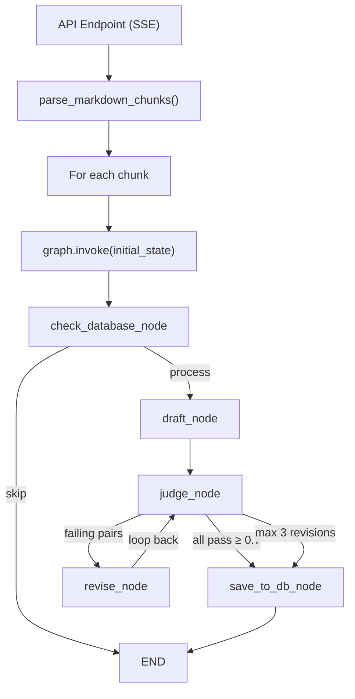

# Active Recall Generator (Note Taker)

A full-stack web application that transforms **Markdown textbook chapters** into **active recall Q&A artifacts**. Designed to enhance study sessions, it uses a sophisticated LangGraph state machine with a **Draft → Judge → Revise** feedback loop powered by Groq's `llama-3.3-70b-versatile`.

## ✨ Key Features & Achievements

- **Full-Stack Architecture**: Modern Next.js (App Router) frontend paired with a robust FastAPI backend.
- **AI-Powered Processing Pipeline**: Uses LangGraph to orchestrate a multi-agent workflow (Draft → Judge → Revise) ensuring high-quality, accurate Q&A generation from source text.
- **Real-Time Execution**: Server-Sent Events (SSE) provide real-time streaming updates to the frontend during pipeline execution.
- **Interactive UI/UX**:
  - Drag-and-drop file upload for Markdown documents.
  - 3-part artifact hierarchy (Source Document → Outline View → Q&A Pairs).
  - Chapter management system for organizing study materials.
- **Secure Authentication**: Hardened Supabase authentication flow, supporting symmetric and asymmetric JWT validation, eager client-side token initialization, and robust middleware protection.
- **Cloud Database**: Fully integrated with Supabase PostgreSQL for persistent, scalable storage of users, documents, outlines, and Q&A artifacts.
- **Deployed Infrastructure**: Frontend hosted on Vercel, Backend hosted on Render.

## 🏗 Architecture Overview

### Backend Pipeline (LangGraph)


### Tech Stack

| Component | Technology |
|-----------|-----------|
| Frontend | Next.js 15, React 19, Tailwind CSS, shadcn/ui |
| Backend API | FastAPI, Uvicorn, SSE-Starlette |
| AI / LLM | Groq (`llama-3.3-70b-versatile`), Langchain |
| State Machine | LangGraph |
| Database & Auth | Supabase (PostgreSQL), `@supabase/ssr` |
| Data Validation | Pydantic (Backend), Zod (Frontend) |

## 🚀 Setup & Local Development

This project uses `uv` for Python dependency management and `pnpm` for Node.js dependency management.

### Backend (FastAPI)
```bash
# Initialize and activate the virtual environment
uv venv
source .venv/bin/activate

# Install dependencies
uv pip install -e .

# Run the backend development server
uv run uvicorn note_taker.api.main:app --reload --port 8000
```

### Frontend (Next.js)
```bash
# Install dependencies
pnpm install

# Run the frontend development server
pnpm dev
```

## 🔒 Environment Variables

You will need the following environment variables configured:

**Frontend (`.env.local`)**:
- `NEXT_PUBLIC_SUPABASE_URL`
- `NEXT_PUBLIC_SUPABASE_ANON_KEY`
- `NEXT_PUBLIC_API_URL` (points to local or deployed FastAPI backend)

**Backend (`.env`)**:
- `SUPABASE_URL`
- `SUPABASE_SERVICE_ROLE_KEY`
- `SUPABASE_JWT_SECRET`
- `GROQ_API_KEY`
- `CORS_ORIGINS`

## 🧠 Data Models

| Model | Role |
|-------|------|
| `QuestionAnswerPair` | One Q&A unit: `question`, `answer`, `source_context`, `judge_score`, `judge_feedback` |
| `OutlineItem` | Recursive tree node: `title`, `level`, nested `items` |
| `FinalArtifactV1` | Root container stored in DB: `source_hash`, `outline[]`, `qa_pairs[]` |

## 🧪 Testing

The backend includes a comprehensive `pytest` suite simulating pipeline workflows and authentication validation.
```bash
uv run pytest
```
