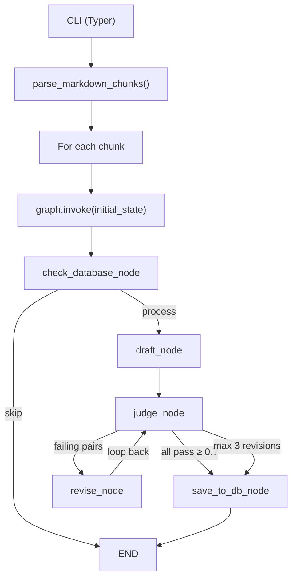

# note-taker

A CLI tool that transforms **Markdown textbook chapters** into **active recall Q&A artifacts**, stored in SQLite. It uses a LangGraph state machine with a **Draft → Judge → Revise** feedback loop powered by Groq's `llama-3.3-70b-versatile`.

## Architecture Overview



## Tech Stack

| Component | Technology |
|-----------|-----------|
| CLI | Typer |
| LLM | Groq (`llama-3.3-70b-versatile`) |
| State Machine | LangGraph |
| Database | SQLite with `sqlite-utils` |
| Data Validation | Pydantic |

## Project Structure

```
src/note_taker/
├── config.py          # DB_PATH config (env-overridable)
├── models.py          # Pydantic models: FinalArtifactV1, DraftResponse, JudgeVerdict, etc.
├── processing.py      # Markdown chunking (H1/H2 splits, code-fence aware)
├── database.py        # Singleton DatabaseManager (SQLite CRUD)
├── llm.py             # get_llm() → ChatGroq client
├── cli.py             # Typer `process` command
└── pipeline/
    ├── state.py       # GraphState (TypedDict)
    ├── nodes.py       # check_database, draft, judge, revise, save_to_db nodes
    └── graph.py       # build_graph() → compiled StateGraph
```

## Pipeline Nodes

| Node | What it does |
|------|-------------|
| `check_database_node` | Hashes content, checks DB. Sets `skip_processing=True` if unchanged. |
| `draft_node` | Calls LLM with `DraftResponse` structured output → creates `FinalArtifactV1` |
| `judge_node` | Calls LLM with `JudgeVerdict` structured output → scores each Q&A (0.0–1.0) |
| `revise_node` | Finds pairs with `judge_score < 0.7`, calls LLM → replaces them (max 3 cycles) |
| `save_to_db_node` | Persists `artifact` to SQLite via `DatabaseManager.save_artifact()` |

## Data Models

| Model | Role |
|-------|------|
| `QuestionAnswerPair` | One Q&A unit: `question`, `answer`, `source_context`, optional `judge_score`/`judge_feedback` |
| `OutlineItem` | Recursive tree node: `title`, `level`, nested `items` |
| `FinalArtifactV1` | Root container stored in DB: `source_hash`, `outline[]`, `qa_pairs[]` |
| `DraftResponse` | Structured output schema for the **draft** LLM call |
| `JudgeVerdict` | Structured output schema for the **judge** LLM call |
| `RevisionResponse` | Structured output schema for the **revise** LLM call |

## Setup

```bash
# Create and activate virtual environment
uv venv && source .venv/bin/activate

# Install dependencies
uv pip install -e .
```

## Usage

```bash
python main.py "BookName:ChapterX" path/to/chapter.md
```

Options:
- `--force-refresh` — Re-process all chunks even if unchanged

## Development Sandbox

Notebooks in `notebooks/` use the `%load` bridge pattern:
- `.py` files in `src/` are the **single source of truth**
- `.ipynb` templates are used as a **scratchpad/debugger**
- Use `%load` to inspect and execute code step-by-step
