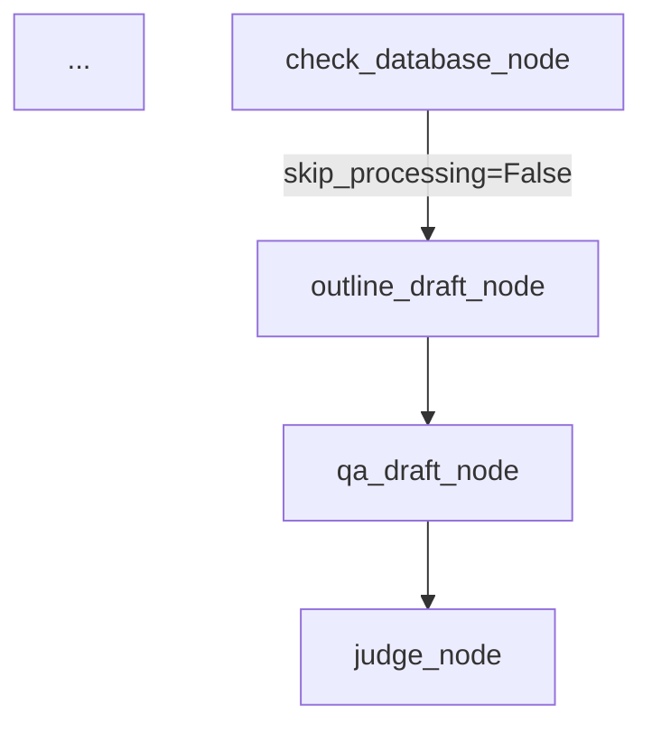

# Brainstorming: Draft Node Splitting & API Load Balancing

## Context
Currently, `draft_node` is a monolithic LLM call that takes raw Markdown and outputs both a structured `Outline` and `Q&A Pairs`. We want to split this to optimize our 9-key API resources (Groq, SambaNova, Cerebras) and enhance the quality and density of the active recall artifacts.

## Proposed New Architecture: Split Draft Pipeline

Instead of a single `draft_node`, we break it down into sequential steps that match the strengths of our different models.

### Step 1: `outline_draft_node`
- **Goal:** Summarize the raw Markdown into a clean, 2-level hierarchical outline.
- **Why Split?** Generating an outline requires reading a lot of text (high input tokens) but generating a short structure (low output tokens). It doesn't require deep reasoning.
- **Target Resource:** **Tier 1 (Speed & Reading)**. We route this exclusively to fast models like Cerebras `llama3.1-8b` or Groq `llama-3.1-8b-instant`.
- **Output:** `OutlineResponse` (containing `List[OutlineItem]`).

### Step 2: `qa_draft_node`
- **Goal:** Generate high-quality Active Recall Q&A pairs.
- **Input:** Raw Markdown + The `Outline` from Step 1.
- **Mapping Rule (N:1):** Generate **1 to 3** high-quality Q&A pairs per Level 2 subtopic, depending on concept density. This prevents forcing multi-part questions into a single card and ensures dense sections are thoroughly covered.
- **Why Split?** Generating good questions requires deep reasoning and nuance.
- **Target Resource:** **Tier 2 (Deep Reasoning)**. We route this exclusively to heavy models like SambaNova `DeepSeek-R1-Distill-Llama-70B`, `Llama-3.3-70B`, or Groq `llama-3.3-70b-versatile`.
- **Output:** `QADraftResponse` (containing `List[QuestionAnswerPair]`).

## The Final Output (`FinalArtifactV1`)

Even with this split, the **final output** stored in the database remains exactly the same (`FinalArtifactV1`). The user won't notice a structural difference, but the system will be faster and generate more comprehensive study materials.

```python
class FinalArtifactV1(BaseModel):
    version: int = 1
    source_hash: str
    outline: List[OutlineItem]        # Generated by outline_draft_node
    qa_pairs: List[QuestionAnswerPair] # Generated by qa_draft_node
```

### Graph Flow Update


## Global Load Balancing Strategy (The "9 API Access" Solution)

To support this new pipeline, we will build an `LLMFactory` (or router) in `llm.py` that categorizes our 9 keys into "Tiers".

1.  **Tier 1: Speed & Reading (Cerebras 8B, Groq 8B)**
    - Used by: `outline_draft_node`, `judge_node`.
    - Strategy: Round-robin across the fast provider keys.
2.  **Tier 2: Deep Reasoning (SambaNova 70B/DeepSeek, Groq 70B)**
    - Used by: `qa_draft_node`, `revise_node`.
    - Strategy: Round-robin across the heavy provider keys.

When a node asks for a model, it asks by tier: `get_llm(tier="reasoning")`. The factory handles automatically rotating to the next available provider/key if one throws a `429 Too Many Requests`.

## Approvals
- [x] Splitting the Draft node into `outline` and `qa`.
- [x] Adopting a flexible N:1 (1 to 3 Q&As per subtopic) mapping strategy.
- [x] Implementing a Tiered LLM Factory to balance the 9 API keys.