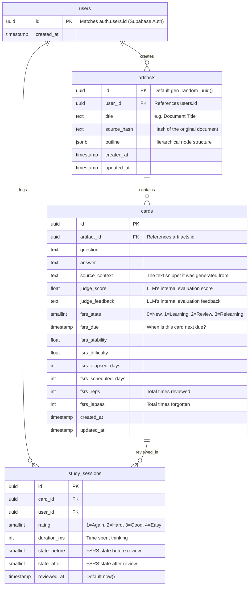

# Supabase Schema Design for SOLO-95

This document outlines the proposed Supabase SQL schema for the active recall generator (replacing the local SQLite database). We are adopting **Approach 2 (FSRS-Ready Schema)** by embedding the FSRS scheduling variables directly into the `cards` table and logging every review event in `study_sessions`.

## Entity-Relationship Diagram

## Python Models Mapping (`src/note_taker/models.py`)

The CLI's Python classes will map to the Supabase schema as follows:

1.  **`FinalArtifactV1`**: 
    - Maps directly to the `artifacts` table.
    - The `outline` field (a `List[OutlineItem]`) will be serialized and stored in the `artifacts.outline` `jsonb` column.
    - The `qa_pairs` field will NOT be stored as a single JSON blob anymore. When saving an artifact, the `DatabaseManager` will insert the artifact record, and then batch insert the `qa_pairs` into the `cards` table linked via `artifact_id`.

2.  **`QuestionAnswerPair`**:
    - Maps to the `cards` table.
    - We will need to update this model (or create a database-specific mirror model) to include the `id` and `artifact_id` fields, as well as the FSRS fields, so the CLI can correctly map them when pulling review data.

3.  **Changes needed for `models.py` (Implementation Phase)**:
    - We will need to augment our data models to handle Supabase schema constructs like UUIDs and timestamps.
    - `QuestionAnswerPair` might be subclassed into something like `CardRecord` to handle the additional database fields when we query it.

## Implementation Notes

1.  **Authentication (Supabase Auth)**:
    *   We do **NOT** store passwords, emails, or sensitive PII in this public schema.
    *   Supabase handles all secure credential storage in a hidden `auth.users` schema automatically.
    *   Our `public.users` table is simply a profile table. When a user signs up via Supabase Auth, a trigger will automatically insert a row into our `public.users` table with the matching `id`, allowing us to link `artifacts` and `study_sessions` to them.
2.  **Row Level Security (RLS)**: We will enable RLS on all tables.
    *   `artifacts`: Users can only `SELECT`, `INSERT`, `UPDATE`, `DELETE` where `user_id = auth.uid()`.
    *   `cards`: Users can only access cards belonging to their artifacts.
    *   `study_sessions`: Users can only insert/view their own sessions.
3.  **Soft Deletes vs. Hard Deletes**: For now, we will use hard deletes cascading from `artifacts` -> `cards` -> `study_sessions` to keep the DB clean unless requirements dictate otherwise.
4.  **FSRS Initialization**: New cards will have `fsrs_state=0` (New), and `fsrs_due` set to `now()`.

## Review Question

Does this ERD and Pydantic mapping cover all the data elements you envision for the fully functioning web application and CLI sync?
