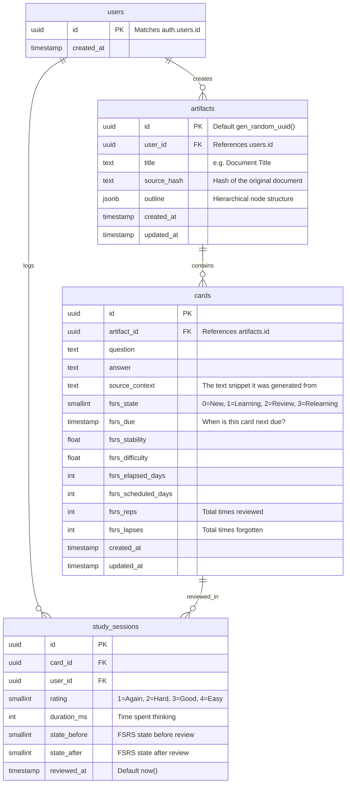

# Supabase Schema Design for SOLO-95

This document outlines the proposed Supabase SQL schema for the active recall generator (replacing the local SQLite database). We are adopting **Approach 2 (FSRS-Ready Schema)** by embedding the FSRS scheduling variables directly into the `cards` table and logging every review event in `study_sessions`.

## Entity-Relationship Diagram

## Implementation Notes

1.  **Row Level Security (RLS)**: We will enable RLS on all tables.
    *   `artifacts`: Users can only `SELECT`, `INSERT`, `UPDATE`, `DELETE` where `user_id = auth.uid()`.
    *   `cards`: Users can only access cards belonging to their artifacts.
    *   `study_sessions`: Users can only insert/view their own sessions.
2.  **Soft Deletes vs. Hard Deletes**: For now, we will use hard deletes cascading from `artifacts` -> `cards` -> `study_sessions` to keep the DB clean unless requirements dictate otherwise.
3.  **FSRS Initialization**: New cards will have `fsrs_state=0` (New), and `fsrs_due` set to `now()`.

## Review Question

Does this ERD cover all the data elements you envision for the fully functioning web application and CLI sync?
