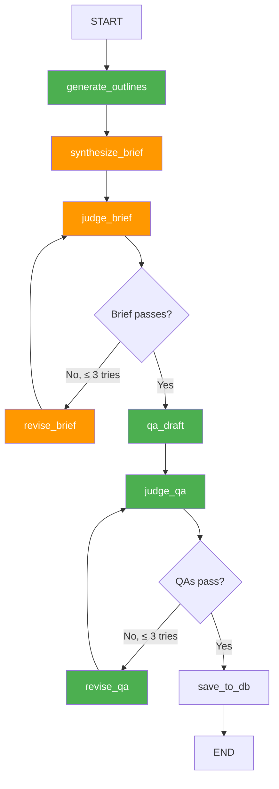

# 80/20 Mastery Brief Pipeline Redesign

## Problem Statement

The current pipeline produces a 2-level structural outline (mirrors headings) + per-subpoint Q&A cards. This yields *complete coverage* but not *leverage* — every subpoint gets a card whether it's foundational or filler.

The goal: redesign the pipeline to produce an **ultra-condensed 80/20 mastery brief** — the smallest set of ideas, concepts, definitions, mechanisms, and relationships that capture ~80% of a chapter's value with ~20% of the effort. Q&As derive from this brief's core ideas only (fewer, higher-leverage cards). **This is NOT a general summary.**

## Design Decisions (From Brainstorming)

| # | Decision | Rationale |
|---|---|---|
| 1 | Q&As derive from mastery brief core ideas only | Fewer, higher-leverage cards that test what matters |
| 2 | Outline stays as internal scaffolding | LLM needs structural orientation before distilling; user doesn't see it |
| 3 | Brief gets its own judge/revise quality gate before Q&A generation | If the brief misidentifies the core 20%, every downstream Q&A tests the wrong things |
| 4 | Per-chapter brief via synthesis of chunk outlines | The "core 20%" depends on seeing the whole chapter's structure, not isolated sections |
| 5 | Hybrid tiers: `reasoning` for brief synthesis + judging, `fast` for outlines + Q&As | Brief is the highest-leverage artifact — deserves the reasoning tier |
| 6 | **Clean slate** — no V1 backward compatibility | Database wiped. Single unified artifact model (`FinalArtifactV2`) |
| 7 | **Single unified graph** — no Phase 1/Phase 2 split | Outline generation is the first node in one graph. One `graph.invoke()`, one SSE stream |

## Anti-Summary Constraint

> [!CAUTION]
> The mastery brief is **not** a summary. Every prompt and judge criterion must enforce this:
> - **Summary** = "Chapter 3 discusses X, Y, and Z" (topic labels, vague overview)
> - **Mastery brief** = "X works because of mechanism M. If you confuse X with Y, you'll miscalculate Z. The key relationship is: A causes B only when condition C holds."
>
> The brief preserves **core logic, cause-effect relationships, and testable definitions** — not topic labels.

---

## Architecture: Unified Single-Graph Pipeline

### Pipeline Flow



🟢 Green = `fast` tier (llama3.1-8b) — structured extraction
🟠 Orange = `reasoning` tier (gpt-oss-120b / llama-3.3-70b) — deep distillation

### How It Works

1. **`generate_outlines`** (`fast` tier) — takes the full source markdown (already chunked by `processing.py`), generates a 2-level outline per chunk internally, concatenates into one structural map. This is internal scaffolding, not surfaced to the user.

2. **`synthesize_brief`** (`reasoning` tier) — takes all chunk outlines + source text, distills into a `MasteryBrief` with 5 sections. This is the critical node — it must identify the ~20% of ideas that carry ~80% of value.

3. **`judge_brief`** (`reasoning` tier) — scores the brief on specificity, density, leverage, anti-summary, and connections. Threshold: ≥ 0.8. If it fails, routes to `revise_brief`.

4. **`revise_brief`** (`reasoning` tier) — rewrites the brief based on judge feedback. Max 3 revisions.

5. **`qa_draft`** (`fast` tier) — derives Q&A cards from the *approved* brief's core ideas. One card per `CoreIdea`.

6. **`judge_qa`** (`fast` tier) — same scoring as today (accuracy, clarity, recall-worthiness). Threshold: ≥ 0.8.

7. **`revise_qa`** (`fast` tier) — fixes failing Q&As. Max 3 revisions.

8. **`save_to_db`** — persists the `FinalArtifactV2` (brief + Q&As).

### Graph State

```python
class GraphState(TypedDict):
    """State for the unified mastery brief pipeline."""
    # Input
    chunk_id: str
    source_chunks: list[dict]         # [{"title": str, "content": str}, ...]
    source_hash: str
    force_refresh: bool

    # Internal scaffolding (not user-facing)
    chunk_outlines: Optional[list[OutlineResponse]]

    # The mastery brief
    mastery_brief: Optional[MasteryBrief]
    brief_revision_count: int

    # The final artifact
    artifact: Optional[FinalArtifactV2]
    qa_revision_count: int

    # Control
    skip_processing: bool
    persist_locally: bool
```

### Data Models

```python
class CoreIdea(BaseModel):
    """A single high-leverage concept from the chapter."""
    idea: str                   # The concept, stated precisely
    why_it_matters: str         # Why this idea is foundational/reusable/testable
    mechanism: str              # How it works — the core logic, not just the label

class MasteryBrief(BaseModel):
    """The ultra-condensed 80/20 mastery brief for a chapter."""
    core_ideas: list[CoreIdea]        # The few concepts that carry most of the chapter
    non_negotiable_details: list[str]  # Key definitions, formulas, principles to memorize
    connections: list[str]             # Cause-effect chains, dependencies, conditions
    common_traps: list[str]           # Misunderstandings, false equivalences
    five_min_review: list[str]        # 5-8 pithy bullets for rapid revision

class FinalArtifactV2(BaseModel):
    """The root container — brief-first, no outline exposed."""
    version: int = 2
    source_hash: str
    mastery_brief: MasteryBrief
    qa_pairs: list[QuestionAnswerPair]
```

### Brief Judge Criteria

```python
class BriefJudgement(BaseModel):
    """Judge's evaluation of the mastery brief."""
    specificity_score: float      # 0-1: Names mechanisms, not just topics?
    density_score: float          # 0-1: Every sentence information-dense?
    leverage_score: float         # 0-1: Actually the 80/20 ideas?
    anti_summary_score: float     # 0-1: NOT a vague overview? (high = good)
    connections_score: float      # 0-1: Shows HOW ideas connect?
    overall_score: float
    feedback: str
```

---

## Key Prompts

### `synthesize_brief` System Prompt (reasoning tier)

> You are a mastery-brief generator. You distill textbook chapters into ultra-condensed 80/20 briefs.
>
> **Your job is NOT to summarize.** Summaries restate topics. You identify the smallest set of ideas, mechanisms, definitions, and relationships that carry ~80% of the chapter's value.
>
> Given: all section outlines from a chapter.
>
> Produce:
> - **core_ideas**: The few concepts that are foundational, reusable, testable, or high-leverage. For each: state the idea precisely, explain WHY it matters, and describe the MECHANISM (how it works).
> - **non_negotiable_details**: Exact definitions, formulas, principles, or constraints the reader must memorize. No vague restatements.
> - **connections**: How the core ideas relate — cause-effect chains, dependencies, necessary conditions. Not "A is related to B" but "A causes B only when C holds."
> - **common_traps**: Misunderstandings, false equivalences, or subtle distinctions that trip up learners.
> - **five_min_review**: 5-8 pithy bullets for rapid revision. Each bullet is a complete, testable claim.
>
> Anti-patterns to AVOID:
> - "This chapter discusses X" (topic label, not a mastery point)
> - "Y is important" (assertion without mechanism)
> - Listing every concept (that's an outline, not 80/20)
> - Historical anecdotes or filler

### `judge_brief` System Prompt (reasoning tier)

> Score the mastery brief. Be ruthless — a vague overview should score below 0.5.
>
> Criteria (0.0–1.0 each):
> - **specificity_score**: Does each core idea name a specific mechanism, definition, or relationship? Or is it a vague topic label?
> - **density_score**: Is every sentence information-dense? Could any sentence be deleted without losing information?
> - **leverage_score**: Are these truly the ~20% of ideas that carry ~80% of value? Or is it just "everything in order"?
> - **anti_summary_score**: Would this pass as a generic textbook summary? If yes, score LOW. A good brief sounds like expert notes, not a book jacket.
> - **connections_score**: Does it show HOW ideas connect (cause-effect, dependency, condition)? Or just list them adjacently?
>
> Threshold: overall_score ≥ 0.8 to pass. Provide specific, actionable feedback for any score below 0.8.

---

## Files Changed

| File | Change |
|---|---|
| `models.py` | Replace V1 models with `CoreIdea`, `MasteryBrief`, `BriefJudgement`, `BriefRevisionResponse`, `FinalArtifactV2` |
| `pipeline/state.py` | Replace `GraphState` with new unified state |
| `pipeline/nodes.py` | Replace all nodes: `generate_outlines`, `synthesize_brief`, `judge_brief`, `revise_brief`, updated `qa_draft`, `judge_qa`, `revise_qa`, `save_to_db` |
| `pipeline/graph.py` | Single unified graph with two judge/revise loops |
| `cli.py` | Simplified: chunk the file, pass all chunks to single graph invocation |
| `api/generate.py` | Update SSE streaming for new node names |
| `api/schemas.py` | Update SSE stage labels |
| `database.py` | Clean schema for V2 artifacts only |

---

## Orchestrator Changes

### CLI (`cli.py`) — Simplified

```python
# Before: loop over chunks, invoke graph per chunk
# After: chunk the file, invoke ONE graph with all chunks

chunks = parse_markdown_chunks(str(file_path))
initial_state = {
    "chunk_id": book_chapter,
    "source_chunks": chunks,
    "source_hash": hash_all_chunks(chunks),
    "force_refresh": force_refresh,
    ...
}
graph = build_graph()
graph.invoke(initial_state)
```

### API (`generate.py`) — Same pattern

```python
# Single invocation, single SSE stream
chunks = [{"title": request.title, "content": request.markdown}]
initial_state = {
    "chunk_id": chunk_id,
    "source_chunks": chunks,
    ...
}
graph = build_graph()
for node_output in graph.stream(initial_state):
    # yield SSE events as before
```
